# Prompt-Based Process Creation

## Overview

This solution, powered by Devin AI, enables the creation and modification of processes and API connectors using natural language prompts. It supports working with API documentation or Swagger/OpenAPI specs, and allows for generating business logic processes that reuse existing components within a Corezoid project.

## Key Features

- Generate processes that connect to external APIs.
- Create business logic processes that reuse existing project processes.

## Quick Start

The solution operates through Devin sessions. Each session must include the `corezoid-doc` project and the corresponding prompt playbook.

### Required Variables  in Playbooks

Each playbook must define the following variables:

- `API_URL`: Corezoid API endpoint
- `API_LOGIN`: Corezoid API login
- `API_SECRET`: Corezoid API secret
- `WORKSPACE_ID`: Workspace ID of the project
- `ROOT_FOLDER_ID`: ID of the project's root folder
- `PROC_ID`: ID of the process being created or modified

### Available Playbooks

- [create-connector.md](playbooks/create-connector.md)
- [create-logic.md](playbooks/create-logic.md)

## Execution Flow

1. Input: a prompt (with all required variables), project ID, and playbook ID
2. Devin analyzes the prompt, playbook, and codebase
3. Initial planning
4. Corezoid project is pulled using `ROOT_FOLDER_ID`
5. Devin explores and analyzes existing processes as needed
6. Secondary planning
7. Process JSON is generated
8. Process is validated using `convctl`
9. If errors are found, analysis and automatic correction are performed; step 8 is repeated
10. If validation is successful, the session is completed

---

## `convctl` Workflow

1. Input: JSON process definition
2. Automatic correction of obvious errors with feedback sent to Devin
3. JSON Schema validation
4. Synchronization with Corezoid cloud:
    - Undo uncommitted changes
    - Remove obsolete nodes
    - Create new nodes
    - Deploy API logic
    - Commit the process
5. Send the task
6. Check the result of the task execution
7. Enhance the result with detailed diagnostics

```mermaid
%%{init: {'theme':'base', 'themeVariables': { 'primaryColor': '#ffffff', 'primaryTextColor': '#000000', 'primaryBorderColor': '#cccccc', 'lineColor': '#666666', 'secondaryColor': '#ffffff', 'tertiaryColor': '#ffffff', 'background': '#ffffff', 'mainBkg': '#ffffff', 'secondBkg': '#ffffff', 'tertiaryBkg': '#ffffff'}}}%%
graph TB
    subgraph Layer1 ["📥 Input Layer"]
        A["1. Input: JSON process definition"]
    end
    
    subgraph Layer2 ["🔧 Processing Layer"]
        B["2. Automatic correction of obvious errors<br/>with feedback sent to Devin"]
        C["3. JSON Schema validation"]
        C["4. Manual validation"]
    end
    
    subgraph Layer3 ["☁️ Synchronization Layer"]
        D1["4.1 Undo uncommitted changes"]
        D2["4.2 Remove obsolete nodes"]
        D3["4.3 Create new nodes"]
        D4["4.4 Deploy API logic"]
        D5["4.5 Commit the process"]
    end
    
    subgraph Layer4 ["📤 Task Layer"]
        E["5. Send the task"]
        F["6. Check the result of<br/>the task execution"]
    end
    
    subgraph Layer5 ["📊 Output Layer"]
        G["7. Enhance the result with<br/>detailed diagnostics"]
    end
    
    A --> B
    B --> C
    C --> D1
    D1 --> D2
    D2 --> D3
    D3 --> D4
    D4 --> D5
    D5 --> E
    E --> F
    F --> G
    
    %% Styling
    classDef inputOutput fill:#e3f2fd,stroke:#1976d2,stroke-width:2px,color:#000000
    classDef process fill:#f3e5f5,stroke:#7b1fa2,stroke-width:2px,color:#000000
    classDef syncSteps fill:#e8f5e8,stroke:#388e3c,stroke-width:2px,color:#000000
    classDef taskSteps fill:#fff3e0,stroke:#f57c00,stroke-width:2px,color:#000000
    classDef diagnostics fill:#ffebee,stroke:#d32f2f,stroke-width:2px,color:#000000
    
    class A inputOutput
    class B,C process
    class D1,D2,D3,D4,D5 syncSteps
    class E,F taskSteps
    class G diagnostics
```

